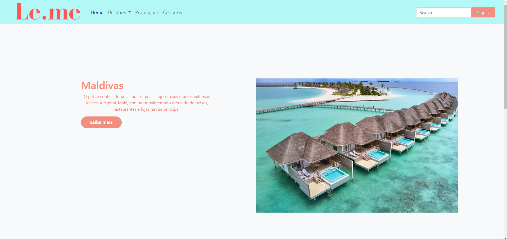
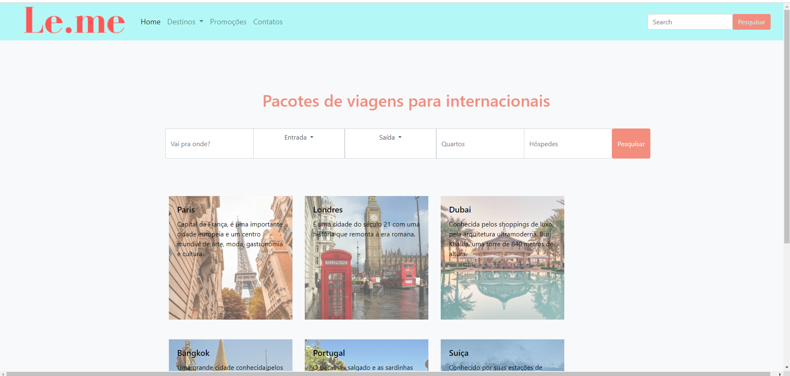
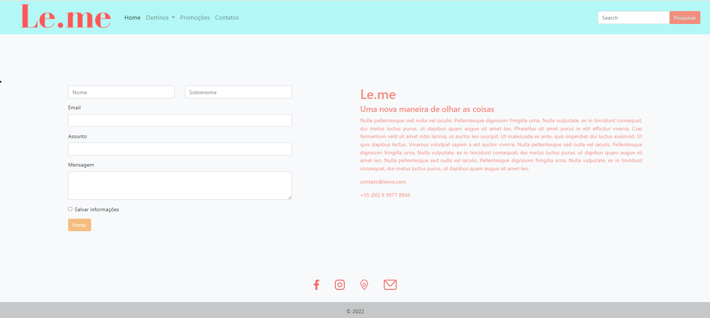

<h1>Leme - Frontend </h1>

Este projeto é um protótipo de um site de agência de viagens desenvolvido individualmente para o bootcamp. 
A aplicação foi desenvolvida usando HTML, CSS, JS, Bootstrap.

<h1 align="center">
    
    
    
    
    
    
</h1>

## 💻 Requisitos

Antes de iniciar, você deve ter o Node.js e o NPM instalados em sua máquina.

## 🚀 Instalando

Primeiro, você deve clonar o projeto na sua máquina, para isso você
pode colar o seguinte comando em seu terminal

```bash
git clone https://github.com/anacmenezes/leme_frontend.git
cd leme_frontend
```

Para instalar as dependências, execute o seguinte comando:

```bash
npm install
```

Por fim, para executar o projeto basta rodar o seguinte:

```bash
npm run dev
```

## 🔧 Compilação

Para compilar a aplicação para produção, execute o seguinte comando:

```bash
npm run build
```
Isso irá gerar uma versão otimizada da aplicação na pasta `dist`.

## 🫂 Integração com Backend

Para realizar a integração com o Backend, você pode clonar o projeto e rodar localmente.

## 📱 Minhas Redes

Instagram: [@1carulm](https://www.instagram.com/1carulm/) &nbsp;&middot;&nbsp;

Linkedin [@AnaMenezes](https://www.linkedin.com/in/ana-menezes-882a8b257/) &nbsp;&middot;&nbsp;
